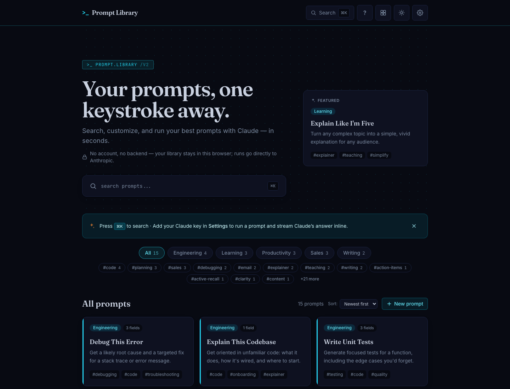

# Prompt Library

A fast, private prompt library for the browser. Save your best AI prompts, fill in their `{{variables}}` from a clean form, and run them against the Anthropic API with your own key — all without an account or a backend of mine in the middle. When you run a prompt, your browser sends it and your key straight to Anthropic; that's the one intentional network call in the app.

Under the hood it runs on a from-scratch streaming client for the Anthropic Messages API — a typed error taxonomy, `retry-after` backoff with a live countdown, and token-by-token rendering — shipped as a static export with a real WCAG 2.2 AA pass and a full test suite.

**Live:** [prompts.skypistudio.com](https://prompts.skypistudio.com)



## Privacy model

Your library is on-device by design; the one thing that leaves is the API call you trigger:

- **Bring your own key.** You paste your own Anthropic API key; it's stored only in your browser and sent only to Anthropic, only when you run a prompt.
- **Your library stays in this browser.** Your prompts, run history, and settings live in `localStorage`. There is no account and no telemetry — nothing is collected, and nothing is sent anywhere except the Anthropic API call you trigger.
- **No backend of its own.** The app ships as a static export with no server, so a run goes directly from your browser to Anthropic — there's no middleman collecting your prompts along the way.

## Stack

- **Next.js 15** (App Router, `output: export` static build)
- **React 19**
- **Tailwind CSS**
- **Vitest** for the test suite

## Run it locally

```bash
npm install && npm run dev
```

Then open [http://localhost:3000](http://localhost:3000).

Other useful scripts: `npm run build` (static export to `out/`), `npm test` (Vitest), `npm run typecheck`, and `npm run lint`.

## Project records

This README, the source in `src/`, and CI in `.github/workflows/` describe the current app. The other root logs and snapshots (`PROJECT_STATE.md`, `DECISIONS_LOG.md`, `FEATURES.md`, `LEARNINGS.md`, `CYCLE_LOG*.md`, `MERGE_ORDER.txt`, `TASK_GRAPH.json`, the `*.yaml` files), plus `qa-reports/` and `specs/`, are dated working records. They come from an AI-assisted build run under [Claude Corp](https://github.com/Skypie99/Claude_Corp) governance, where release decisions stay with the owner. `PROJECT_EXTRACTION.md` is a superseded May 2026 snapshot, kept for history.

## License

MIT — see [LICENSE](LICENSE). Use it, fork it, ship it.

---

Built by Sky Halisky — [GitHub](https://github.com/skypie99) · [LinkedIn](https://www.linkedin.com/in/skyler-halisky)
